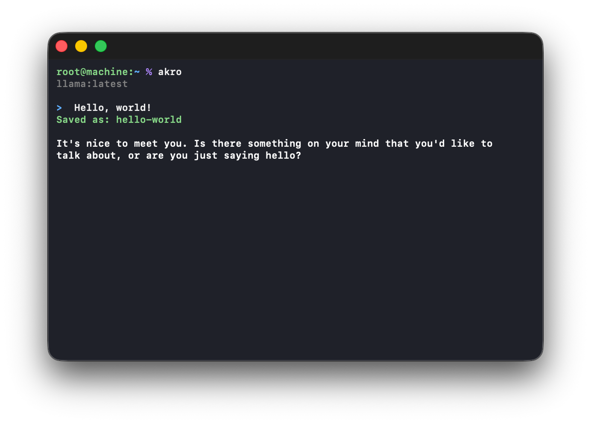

<p align="center">
  
</p>

# Akro

Akro is a tiny terminal chat client for local Ollama models on macOS.

It is built to stay simple. One shell script handles the chat, one JSON file holds prompt skills, and conversations are saved as plain JSON.

<p align="center">
  
</p>

## Features

- local Ollama chat at `127.0.0.1:11434`
- full conversation history
- finished responses rendered with Glow
- tiny Neuron model that names chats after the first prompt
- saved conversations
- reopen chats with their original model
- simple one-turn prompt skills
- readline-style terminal input
- lightweight thinking animation

No web search, document system, memory layer, system prompt loader, token tracker, or context manager.

## Requirements

Akro currently supports macOS.

You need:

- [Ollama](https://ollama.com/)
- `curl`
- `jq`
- [Glow](https://github.com/charmbracelet/glow)
- at least one Ollama chat model

With Homebrew:

```bash
brew install jq glow